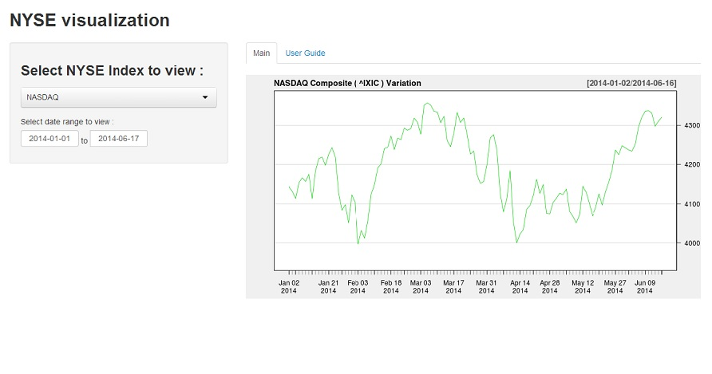

## What is NYSEIndex


- Easy way to view New York Stock Exchange indexes
  - NASDAQ Composite (\^IXIC)
  - Dow Jones Industrial Average (DJIA)
  - Define Date Ranges
- Reactive!



---

## Where do data come from?
- Data comes from Yahoo, through the R "getSymbols()" function.

```r
library(shiny)
library(quantmod)
library(lattice)

data <- getSymbols("^IXIC", src = "yahoo", from = "2014-06-09", to = "2014-06-13", 
    auto.assign = FALSE)
```


---
## What do the actual data look like?


```r
head(data)
```

```
##            IXIC.Open IXIC.High IXIC.Low IXIC.Close IXIC.Volume
## 2014-06-09      4324      4347     4320       4336   1.783e+09
## 2014-06-10      4329      4339     4320       4338   1.787e+09
## 2014-06-11      4323      4338     4315       4332   1.778e+09
## 2014-06-12      4323      4328     4285       4298   1.908e+09
## 2014-06-13      4315      4318     4288       4311   1.755e+09
##            IXIC.Adjusted
## 2014-06-09          4336
## 2014-06-10          4338
## 2014-06-11          4332
## 2014-06-12          4298
## 2014-06-13          4311
```


The IXIC.Close column is what we are looking for.

---

## Application Components


---

## What Next?

- Run the application [https://themosp.shinyapps.io/NYSEIndex/](https://themosp.shinyapps.io/NYSEIndex/)
- Download the code from GitHub: [https://github.com/Themosp/themosp.github.io](https://github.com/Themosp/themosp.github.io)
- View this presentation online on GH-Pages: [http://themosp.github.io](http://themosp.github.io)


### Important Note! 
<code>The information presented in the NYSEIndex application is intended for informational purposes only and should not be used for business, commercial or other activities. All financial trading has risk and includes the danger of financial losses.</code> <span, style='color:blue'>Themosp</span> <code>may not be held responsible for any damages which may arise as a concsequence of the use of the data presented in the NYSEIndex application or from the use of the application itself.</code>


